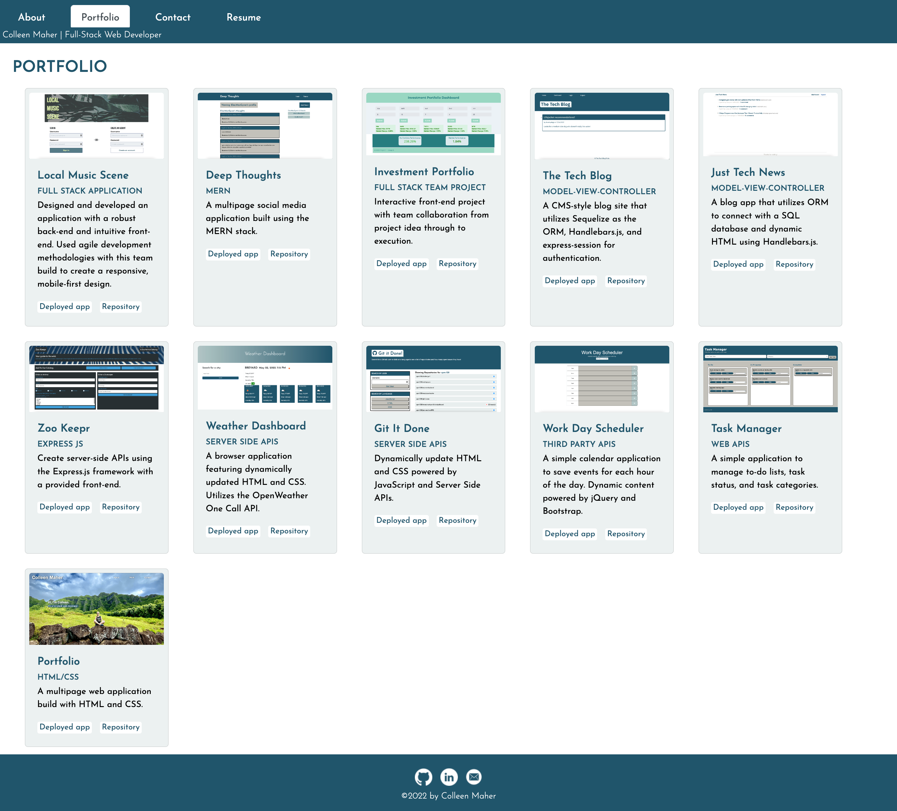

# Portfolio Built With React

## Description
A portfolio of my web development works to share with fellow developers, collaborate on future projects, apply for jobs, and showcase for freelancing. This portfolio is built using React.

### User Story
AS AN employer looking for candidates with experience building single-page applications, 
I WANT to view a potential employee's deployed React portfolio of work samples 
SO THAT I can assess whether they're a good candidate for an open position.

## Table of Contents
- <a href="#acceptance-criteria">Acceptance Criteria</a>
- <a href="#installation">Installation</a>
- <a href="#usage">Usage</a>
- <a href="#mock-up">Mock-Up</a>
- <a href="#deployed-application">Deployed Application</a>
- <a href="contributors">Contributors</a>
- <a href="#license">License</a>

## Acceptance Criteria
GIVEN a single-page application portfolio for a web developer . . .

WHEN I load the portfolio 
THEN I am presented with a page containing a header, a section for content, and a footer

WHEN I view the header 
THEN I am presented with the developer's name and navigation with titles corresponding to different sections of the portfolio

WHEN I view the navigation titles 
THEN I am presented with the titles:
   - About Me
   - Portfolio
   - Contact
   - Resume
and the title corresponding to the current section is highlighted

WHEN I click on a navigation title 
THEN I am presented with the corresponding section below the navigation without the page reloading and that title is highlighted

WHEN I load the portfolio the first time 
THEN the About Me title and section are selected by default

WHEN I am presented with the About Me section 
THEN I see a recent photo or avatar of the developer and a short bio about them

WHEN I am presented with the Portfolio section 
THEN I see titled images of six of the developer’s applications with links to both the deployed applications and the corresponding GitHub repository

WHEN I am presented with the Contact section 
THEN I see a contact form with fields for a name, an email address, and a message

WHEN I move my cursor out of one of the form fields without entering text 
THEN I receive a notification that this field is required

WHEN I enter text into the email address field 
THEN I receive a notification if I have entered an invalid email address

WHEN I am presented with the Resume section 
THEN I see a link to a downloadable resume and a list of the developer’s proficiencies

WHEN I view the footer 
THEN I am presented with text or icon links to the developer’s GitHub and LinkedIn profiles, and their profile on a third platform (Stack Overflow, Twitter)

## Installation
- Clone the directly from the GitHub repository to your local machine.
- Run _npm i_ in the command line.
- Run the command _npm start_ to launch the application.

### Tools and Required Packages
- React App
- Bootstrap

## Usage
To display a portfolio of work, contact information, and biography for a web developer professional to share with other industry professionals for collaboration and/or hiring purposes.

## Mock-Up

## Deployed Application
Deployed url: <a href='https://cpm-128.github.io/portfolio-react/' target='_blank'>https://cpm-128.github.io/portfolio-react/</a> 
Repo url: <a href='https://github.com/cpm-128/portfolio-react' target='_blank'>https://github.com/cpm-128/portfolio-react</a>

### Screencapture
About homepage 

Portfolio page component 

## Contributors
Colleen Maher

### Author
Colleen Maher is a front-end web developer with a background in marketing, operations, and project management.

Trained at UNC Chapel Hill to earn a Professional Certificate in full-stack web development. Newly developed skills include JavaScript, managing databases, responsive web design, and following the Model-View-Controller paradigm. I am an organized and detail-oriented coder wanting to create and contribute to improved user-experiences and database management in an increasingly digital world. Strengths in creativity, teamwork, and building projects from ideation to execution.

<a href="https://github.com/cpm-128" target="_blank">GitHub Profile</a>

## License
MIT License

Copyright (c) [2022] [Colleen Maher]

Permission is hereby granted, free of charge, to any person obtaining a copy
of this software and associated documentation files (the "Software"), to deal
in the Software without restriction, including without limitation the rights
to use, copy, modify, merge, publish, distribute, sublicense, and/or sell
copies of the Software, and to permit persons to whom the Software is
furnished to do so, subject to the following conditions:

The above copyright notice and this permission notice shall be included in all
copies or substantial portions of the Software.